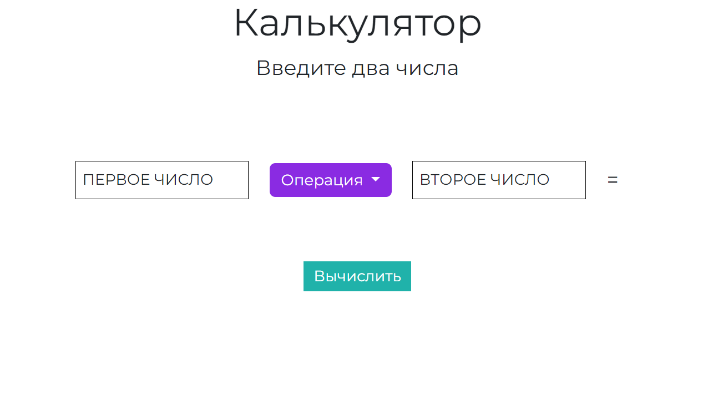
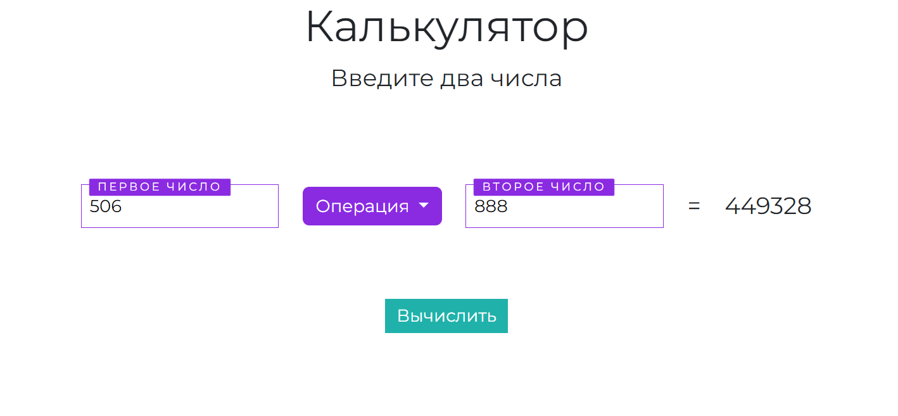

# Калькулятор

Простейший калькулятор, реализованный на языках JavaScript, HTML, CSS(front), Python(back) с использованием технологии Electron.js.  

# Компоненты, находящиеся в репозитории:  
main.js - cкрипт, управляющий основным процессом, который запускается в полной среде Node.js.

preload.js - скрипт предварительной загрузки, который имеет доступ как к глобальным объектам рендеринга, так и к среде Node.js. В данном скрипте соединяется файл index.html с функциями JS.

index.html - индексный файл, первая HTML-страница, которую видит пользователь.

style.css - файл таблицы стилей CSS.

main.py - простейший Flask сервер(REST API на Python).

# Скриншоты интерфейса десктоп приложения

Была выбрана операция "Умножение"
